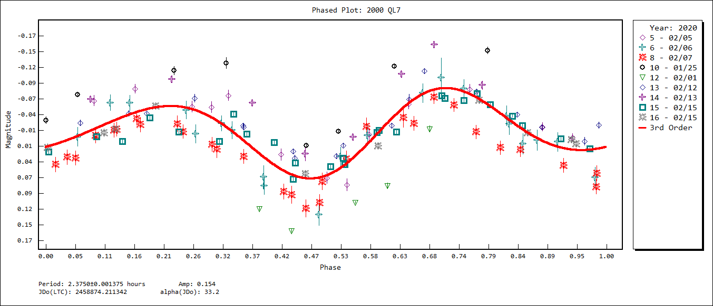

# (18172) = 2000 QL7 = 1986 CA

Discovered at Socorro on 2000-08-25 by LINEAR.

first observation date used	1977-07-21.0
last observation date used	2020-05-22.0

## Orbit

Orbit type: **Amor**
1+ KM Near-Earth Object

## Period
ALCDEF 		**2.37512 Hours**
Light Curve	**2.3750 Hours**

