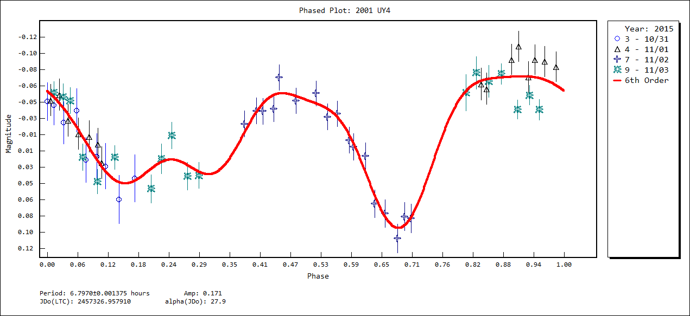

# (194268) = 2001 UY4

Discovered at Socorro on 2001-10-16 by LINEAR.

first observation date used	2001-10-16.0
last observation date used	2019-12-20.0
462 total observations

## Orbit

Orbit type: **Apollo**
Potentially Hazardous NEA

JD of orbit computation			2455934.327255
perihelion JD uncertainty (days)	1.0463E-05
argument of perihelion uncertainty (°)	6.6315E-05
ascending node uncertainty (°)		6.6976E-05
inclination uncertainty (°)		3.4045E-06
eccentricity uncertainty		3.9152E-08
perihelion distance uncertainty (AU)	5.6923E-08

## Period
ALCDEF 		**6.8020  Hours**
Light Curve	**6.7970 Hours**

