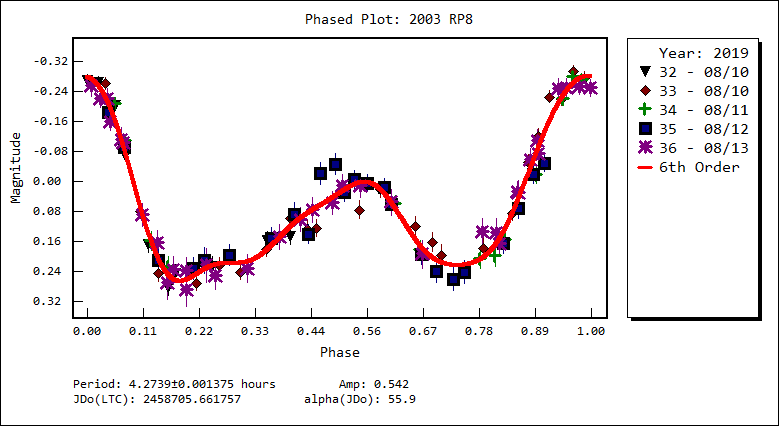

# (455432) = 2003 RP8

Discovered at Socorro on 2003-09-07 by LINEAR.

first observation date used	2003-08-03.0
last observation date used	2020-01-18.0
587 total observations

## Orbit

Orbit type: **Apollo**
Near-Earth Object

JD of orbit computation			2457429.572907
perihelion JD uncertainty (days)	1.2878E-04
argument of perihelion uncertainty (°)	2.7238E-05
ascending node uncertainty (°)		1.1767E-05
inclination uncertainty (°)		1.0589E-05
eccentricity uncertainty		5.8686E-08
perihelion distance uncertainty (AU)	1.0676E-07

## Period
ALCDEF 		**4.2736  Hours**
Light Curve	**4.2739 Hours**

